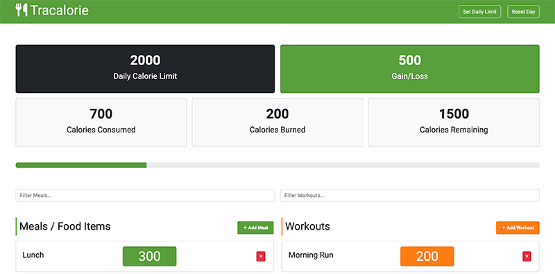

<h1 align="center">Tracalorie Webpage </h1>

This project is based on the course - [Modern JavaScript From The Beginning 2.0](https://www.traversymedia.com/modern-javascript-2-0) and is written in Vanilla JavaScript using an Object-Oriented Programming style.

The webpage is deployed on [Vercel](https://vercel.com/) can be viewed [here](https://tracalorie-app-ecru.vercel.app/).



The webpage is for tracking calories, meals, and workouts. Users can input this information and track their calorie intake.

The template is the same as the one used in the course, but the code has been refactored to my preference.

#### Functionalities

- Set daily limit
- Add meals/food
- Add workouts
- Filter meals and workouts
- Delete meals and workouts
- Calculate Gane/Loss
- Calculate consumed calories
- Calculate burned calories
- Calculate remaining calories
- Progress bar
- Reset day

#### Technologies

- JavaScript
- [Webpack](https://webpack.js.org)
- [Bootstrap](https://getbootstrap.com)
- [Fontawesome](https://fontawesome.com)

#### Deployment

In the `webpack` directory, Webpack has been set up. The classes have been split into modules and built for production.

#### Runnin Localy

- Download the `webpack` folder
- Navigate into the folder
- Install the [Node.js](https://nodejs.org/en)
- Install Dependencies

```
npm i
```

- Build the Project

```
npm run build
```

- Run the project locally

```
npm run dev
```

#### Templates adjustment

The template styles can be adjusted using the SCSS files located in the `scss` folder.
